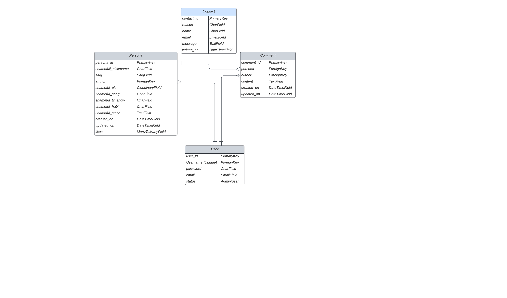

# Wall of Shame

## Project Portfolio 4 - Full Stack Development 
## Full-Stack site - XXXXXX


 [amiresponsive](https://ui.dev/amiresponsive) 


## Live Project


[View the live project here.]

---

## Site info

 - Wall of shame is an application which encourages people to share their shameful experiences or shameful information about them in order to overcome the burden of feeling ashamed of something 
and the stigmatization which comes with it . 
A choice to laugh about things that we’re usually avoiding to tell. A place to  discover other shameless fellows whos embarrass one ethos: 
Better than laugh than cry.

---

## Table of CONTENTS

* [Project Goals](#project-goals)
  * [User Goals](#user-goals)
  * [Site Owner Goals](#site-owner-goals)

* [User Experience](#user-experience-ux)
  * [Target Audience](#target-audience)
  * [User Requirements and Expectations](#user-requirements-ans-expectations)
  * [User Stories](#user-stories)

* [Technical Design](#technical-design)
  * [Agile Methodology](#agile-methodology)
  * [CRUD Functionality](#crud-functionality)
  * [Database Model](#database-model)
  * [Colour Scheme](#colour-scheme)
  * [Typography](#typography)
  * [Wireframes](#wireframes)

* [Features](#features)
  * [Future Implementations](#future-implementations)
 

* [Technologies Used](#technologies-used)
  * [Languages Used](#languages-used)
  * [Frameworks, Libraries](#frameworks-libraries)
  * [Storage & Hosting](#storage--hosting)
  * [IDE & Version Control](#ide--version-control)
  * [Other tools](#other-tools)

* [Deployment](#deployment)
  
* [Testing](#testing)

* [Credits](#credits)
  * [Code Used](#code-used)
  * [Content](#content)
  * [Media](#media)
  * [Acknowledgments](#acknowledgments)

---


## Project Goals

### User Goals

To be able to share an  individual persona ( a blog post conceived as a glimpse of our many outrageous identities) on the website. 
To be able to comment and like on other users’ personas.
To be able to use CRUD functionality whilst logged onto the site

### Site Owner Goals

To provide a platform in which users can share persona
To provide an enjoyable user experience which would make users wish to return to the site
To have the ability to be given feedback via a contact form

---


## User Experience (UX)

### Target Audience

People who enjoy dark humor
People who can laugh about themselves
People who enjoy seeing the positive aspect (better laughing than crying) out of a shameful situation
People who wish to share their story to encourage other people to overcome stigmatization of shame
People who are looking for a way to interact with other people who dare to laugh about themselves

### User Requirements ans Expectations

A site which provides a good level of interactiveness between users
Links and functions to act as expected
Notification to provide feedback on expected function outcomes
Simple content that a user can easily digest
Responsiveness to allow pleasant use across devices of different screen sizes


### User Stories


 User Story ID | As a/an | I want to be able to... | So that I can... |
| --- | ----------- | ----------- | ----------- |
 | Viewing and Navigation | 
| 1 | Site User | see a well defined landing page | understand the purpose and main features of the website | 
 | 2 | Site Owner | Restrain the access of the contents with a required registration | ensure the privacy sphere| 
 | 3 | Site User| see persoa list| select one to read | 
 | 4 | Site User | see a pagination | easyly navigate | 
 | 5 | Site User | open a persona | click on a persona so that I can read the full persona | 
 | 6 | Site User| see likes | view the number of likes on each placard | 
 | 7 | Site User | see comments | read the conversation and particpate | 
 | Registration and User Accounts | 
 | 8 | Site User |  create an account with a user name and passwordt |  log in to access content | 
 | 9 | Site User | login or logout | access or quit the content of the site | 
 | Persona | 
 | 10 | Site User | see list of persona | select one and discover more about the one selected | 
 | 11 | Site User | create a persona from a form | share my persona with others | 
 | 12 | Site User | modifiy my persona | showcase other perspectives/ correct mistakes or improve content | 
 | 13 | Site Owner | create, read, update and delete persona | control the conent of the site | 
 | Contact | 
 | 14 | Site User | contact the Site Owner  | report a personal matter |   
 | 15 | Site User | receive feedback  | confirm whether the contact form submission was successful or not. | 
 | Comment | 
 | 16 | Site User | comment persona | interact with the other persona owners | 
 | 17 |Site Owner| create and delete and update comments| control the content of the app | 
 | Like | 
 | 18 | Site User | Site User| show my appreciation of another user's persona | 
 | 19 | Site Owner | Like / unlike | In case I wish to delete a rating and or a written review | 
 | Feedback | 
 | 20 | Site User | receive feedback when I interact with the site | I know if my actions are successfull | 
 | Search  | 
 | 21 | Site User | search for persona with some keywords | find a Persona which having corrXX | 

---


## Technical Design

### Agile Methodology

- Throughout this project, an agile approach has been applied in order to develop the website. Each activity was broken down into manageable actions from initially  10 milestones, which were then broken down into smaller units : issues. Each issue was labeled to identify their main topics and represent a user story. 
- Each user story  had different acceptance criteria and series of tasks. GitHub's project was used to track these user stories, implement ideas, and monitor the workflow. Indeed, the kanban board allowed the workflow to focus first on the essential features, work in small iteration, adding extra features in case the time allowed it.
- When I was working on the project, I chose one issue to work on from the "Todo" column of the Dashboard Wall of Shame and moved it into the "In Progress" column.
After I finished the issue by fulfilling all the acceptance criteria and the  tasks attached to them, I closed the issue which moved it automatically into the "Done" Column.
The issues that I couldn’t tackle from the "Todo" column ended in the “Won’t do” column.


<details>
<summary>Issue Samples</summary>


</details>


### CRUD Functionality

 Wall of shame handles data with full CRUD Functionality. User's prerogatives are :

 #### Persona

 | Create | Read | Update | Delete |
 | ------------- | ------------- | -------------    | ------------- |
 |  Yes  | Yes  | Yes | Yes |


 #### Comment

  | Create | Read | Update | Delete |
  | ------------- | ------------- | -------------    | ------------- |
  |  Yes  | Yes  | No | No |

 #### Contact

  | Create | Read | Update | Delete |
  | ------------- | ------------- | -------------    | ------------- |
  |  Yes  | No  | No | No |
  

### Database Model

A backend database was  built with the Django framework and the use of ElephantSQL Postgres for the deployed site.

## Classes

The User class is the default User class from Django.

The Persona class is the key custom class in this project as the main function of the site is for users to share their Personas.

|Persona ||
|-----|----|
|field name|type|
|shamefull_nickname|CharField|
|slug|SlugField|
|author|ForeignKey-CharField|
|shameful_pic|CloudinaryField|
|shameful_song|CharField|
|shameful_tv_show|CharField|
|shameful_habit|liCharFieldkes|
|shameful_story|TextField|
|created_on|DateTimeField|
|updated_on|DateTimeField|
|likes|ManyToManyField|

The Comment class denotes a section of text generated by a user and associated with a Persona. Multiple Comments can be associated with a Persona, but each Comment can only be linked to a single Persona. A User can author multiple Comments, but each Comment can only have a single author.

|Comment ||
|-----|----|
|field name|type|
|persona|ForeignKey|
|author|ForeignKey|
|content|TextField|
|created_on|DateTimeField|
|updated_on|DateTimeField|

The Like class represents a user has liked an individual persona

|Like ||
|-----|----|
|field name|type|
|author|ForeignKey|
|persona|ForeignKey|

The Contact Class represents a contact message from the user to the admin in order to report a matter.

|Contact ||
|-----|----|
|field name|type|
|reason|CharField|
|name|CharField|
|email|EmailField|
|message|TextField|
|written_on|DateTimeField|

<details>
<summary>Database Schema</summary>

</details>


### Colour Scheme

 - The colour scheme used in this project was chosen with the tool mycolor to create harmonious colours. The colors have been consistently maintained throughout the website in order to keep a cohesive style.

 <details>
 <summary>Colour Palette</summary>
 
 </details> 


### Typography

 - Fonts were imported using Google Fonts. Roboto, Nunito and Comforter were used throughout with a backup of sans-serif.


### Wireframes


## Features

### Authentication - Log in

Authentication is a feature of the Wall of Shame site, users will have to be authenticated whilst attempting to log in or else they will not be able to use any functionality of the site or view any information that WoS users have posted.

<details>
<summary>Authentication image</summary>

</details>

### Sign up

The register feature can be found bevor the log in page. This feature allows users to register and create an account with persona via a form and keep privacy of the WoS community. XXXXX

<details>
<summary>Sign up image</summary>

</details>


### Log out 

The log out feature can be found from the nav bar for authenticated users.

<details>
<summary>Log out images</summary>

</details>


### Home Page

The home page is accessible when the user is registered/Logged in. The page displays the list of personas.

<details>
<summary>Home page image</summary>

</details>


### Create Persona

The create persona feature can be found from the home page through the button "Create a Persona".

details>
<summary>Create Persona image</summary>

</details>


### Post Comment

The post comment feature can be accessed from any user's persona detail page, below the persona is a form to enter a comment. The comment will then be posted under the persona.

<details>
<summary>Persona comment image</summary>

</details>


### Like count 

The like count feature can be found at the bottom of a persona. The total number of likes on the current persona will be displayed.

<details>
<summary>Like count image</summary>


</details>

### Like / Unlike button

The like / unlike button feature can be found under a persona in the post details page. A user can click on the like button and it will add / subtract a like based on the user's current like status for that persona.


### Comment count

The comment count feature can be found at the bottom of a persona. The total number of likes on the current persona will be displayed.

<details>
<summary>Comment count image</summary>


</details>

### Edit Persona

The edit persona feature can be found a the bottom of the persona detail page of a currently logged in user and allows the caption of the post to be updated. The edit button will only be visible to owners of that persona to avoid other users editing persona they do not own.

<details>
<summary>Edit persona images</summary>


</details>

### Delete Post

The delete post feature can be found at the bottom of the persona detail page of a currently logged in user. The delete button will only be visible to owners of that persona to avoid other users deleting personas they do not own.

<details>
<summary>Delete Post images</summary>


</details>

### Contact

The contact feature can be found from the nav bar and allows both signed in users and anonymous users to contact the site admin.


<details>
<summary>Contact image</summary>

</details>


### Error Pages

The error pages features will display 404 and 500 error pages and allow the user to easily navigate back to the site.

<details>
<summary>Error Page images</summary>

</details>


### User Search

The user search bar feature can be found from the nav bar for authenticated users.


<details>
<summary>User Search image</summary>

</details>


### Future Implementations


---

## Technologies Used


### Languages Used

- [HTML5](https://en.wikipedia.org/wiki/HTML5)

- [CSS3](https://en.wikipedia.org/wiki/CSS)

- [JavaScript](https://en.wikipedia.org/wiki/JavaScript)

- [Python](https://en.wikipedia.org/wiki/Python_(programming_language))

### Frameworks, Libraries

- [Django 3.2.16](https://www.djangoproject.com/) - Used to rapidly develop the site.
- [Gunicorn](https://gunicorn.org/) - Used for being a pure-Python HTTP server for WSGI applications
- [django-summernote](https://github.com/summernote/django-summernote) - Used as the WYSIWYG editor in the admin panel.
- [Crispy Forms](https://django-crispy-forms.readthedocs.io/en/latest/) - Used to format forms.
- [dj3-cloudinary-storage](https://pypi.org/project/dj3-cloudinary-storage/) - Used to serve static files and media. 
- [Psycopg2](https://pypi.org/project/psycopg2/) - Used as a PostgreSQL adaptor
- [Django allauth](https://django-allauth.readthedocs.io/en/latest/index.html)  - Used to implement account authorisation and providing associated templates
- [jquery library](https://ajax.googleapis.com/ajax/libs/jquery/1.12.4/jquery.min.js) - Used to fade out alert messages
- [dj_database_url](https://pypi.org/project/dj-database-url/) - Used to allow database urls to connect to the postgres db
- [Bootstrap 5](https://getbootstrap.com/docs/5.0/getting-started/introduction/) - Used to develop the layout of the site.
- [Font Awesome](https://fontawesome.com/) - Used to produce icons on the site.
- [Google Fonts](https://fonts.google.com/) - Used to import the site's font family.

### Storage & Hosting

- [Github](https://github.com/) - Used to create and store the project repository.
- [Heroku Platform](https://id.heroku.com/) - Used to deploy the live project.
- [ElephantSQL](https://www.elephantsql.com/) - Used to host the website's PostgreSQL database.
- [Cloudinary](https://cloudinary.com/) - Used to store post images.

### IDE & Version Control

- [Gitpod](https://gitpod.io/) - Used to create files and write code.
- [Git](https://git-scm.com/) - Used for version control.

### Other Tools

- [Balsamiq](https://balsamiq.com/) - Used to create Wireframes for the project.
- [mycolor](https://mycolor.space/) - for creating harmonious colors.
- [Responsinator](http://www.responsinator.com/) - test responsive website.
- [W3 Schools](https://www.w3schools.com/) - for HTML, CSS, Django tips. 
- [LearnDjango](https://learndjango.com/) - for understanding the logic of Django
- [Django Docummentation](https://docs.djangoproject.com/en/3.2/) - to research and learn specific utilisation of Django framework
- [readme-examples](https://github.com/kera-cudmore/readme-examples/blob/main/milestone1-readme.md#testing) -for creating the core strucutre of my README.md

---


## Deployment 


### Creating a Gitpod Workspace

1. Log in to GitHub and go to the [Code Institute student template for Gitpod](https://github.com/Code-Institute-Org/gitpod-full-template)
2. Click 'Use this Template' next to the Green Gitpod button.
3. Add a repository name and click 'Create reposiory from template'.
4. This will create a copy of the template in your own repository. Now you can click the green 'Gitpod' button to open a workspace in Gitpod.


### Installing support libraries and Django

```
$ pip3 install 'django<4' gunicorn
$ pip3 install dj_database_url psycopg2
$ pip3 install dj3-cloudinary-storage
$ pip3 install django-crispy-forms  
$ pip3 install crispy-bootstrap5
$ pipe install django-summernote
```

### Create requirements file

```
$ pip3 freeze --local > requirements.txt
```

### Create a project

```
$ django-admin startproject wall_of_shame .
```

### Create placard & contact app and add them to settings.py

```
$ python3 manage.py startapp placard
$ python3 manage.py startapp contact
INSTALLED_APPS = [
    'django.contrib.admin',
    'django.contrib.auth',
    'django.contrib.contenttypes',
    'django.contrib.sessions',
    'django.contrib.messages',
    'django.contrib.sites',
    'cloudinary_storage',
    'django.contrib.staticfiles',
    'cloudinary',
    'crispy_forms',
    'crispy_bootstrap5',
    'django_summernote',
    'placard',
    'contact',
]
```

### Migrate changes

```
$ python manage.py makemigrations
$ python manage.py migrate
```


### Creating a database

1. Go to [ElephantSQL.com](https://elephantsql.com/) and select to create a database
2. Select the free database plan
3. Select “Log in with GitHub” and authorise with GitHub
4. Create new team form. You can use your name, read and agree to the T&C's, select yes for GDPR, provide your email address and click Create Team. Your account will be created 
5. From your dashboard, click “Create New Instance”
6. Set up your plan. Give it the same name as your project, select the free plan. Select "select region" and select a region close to you.
7. Click review, and if the details are correct, click create instance.
8. Return to the ElephantSQL dashboard and click on the database instance name for this project
9. In the URL section, clicking the copy icon will copy the database URL to your clipboard

```
import os
import dj_database_url
if os.path.isfile('env.py'):
  import env
```

### Creating Cloudinary account

1. The app uses Cloudinary to host the post images therefore a Cloudinary account will be required. 
2. Log in to [Cloudinary](https://cloudinary.com/) or create an account for free.
3. Navigate to the Dashboard on Cloudinary.
4. Copy and store the value of the 'API Environment Variable" beginning at cloudinary:// until the end, this will be used in the Heroku Config Vars. 

### Creating env.py

1. place env.py to the project root directory
2. add env.py to git.ignore to avoid pushing this file to GitHub
3. Add the following entries into the file

```
import os
os.environ["DATABASE_URL"] = the databse URL from ElephantSQL
os.environ["SECRET_KEY"]= a string used to generate security keys
os.environ["CLOUDINARY_URL"] = The url for Cloudinary storage
```

### Creating a Procfile to project root directory

```
web: gunicorn wall_of_shame.wsgi
```

### Creating an application with Heroku


1. Create a Heroku account and log in.
2. Create a new app. When you do so, select the closest region to you and give it an appropriate name. Note Heroku names must be unique
3. In your app Settings, add the config var DATABASE_URL, and for the value, paste in your database url from ElephantSQL.
4. In your app Settings, add the config var DJANGO_SECRET_KEY. Generate a DJANGO_SECRET_KEY and paste it in. Keep this secret.
5. Connect Heroku to github repository
6. Deploy from branch manually (before final deployment: the debug setting in settings.py was set to false for security, X_FRAME_OPTIONS = 'SAMEORIGIN' was added and  the DISABLE_COLLECTSTATIC config var in Heroku has to be removed)

```
# SECURITY WARNING: don't run with debug turned on in production!
DEBUG = False
```


### Forking the GitHub Repository

Forks are used to propose changes to someone else's project or to use someone else's project as a starting point for your own idea. By forking the GitHub Repository you make a copy of the original repository on our GitHub account to view and/or make changes without affecting the original repository.

To Fork a Github Repository:

1. Log in to GitHub and go to the [GitHub Repository](https://github.com/Isabella-Mitchell/gather-recipe-website)
2. Locate the Fork button in the top-right corner of the page, click Fork.
3. You should now have a copy of the original repository in your GitHub account.

### Making a Local Clone

You will now have a fork of the repository, but you don't have the files in that repository locally on your computer.

To make a local clone:

1. Log in to GitHub and go to the [GitHub Repository](https://github.com/Isabella-Mitchell/lonely-house)
2. Above the list of files, click  Code.
3. To clone the repository using HTTPS, under "Clone with HTTPS", click the 'Copy' icon. To clone the repository using an SSH key, including a certificate issued by your organization's SSH certificate authority, click Use SSH, then click the 'Copy' icon. To clone a repository using GitHub CLI, click Use GitHub CLI, then click the 'Copy' icon.
4. Open Git Bash.
5. Change the current working directory to the location where you want the cloned directory.
6. Type git clone, and then paste the URL you copied earlier. It will look like this, with your GitHub AE username instead of YOUR-USERNAME:

```
$ git clone https://github.com/YOUR-USERNAME/YOUR-REPOSITORY
```

7. Press Enter. Your local clone will be created.

---


## Testing

Start as you mean to go on - and get used to writing a TESTING.md file from the very first project!

Testing requirements aren't massive for your first project, however if you start using a TESTING.md file from your first project you will thank yourself later when completing your later projects, which will contain much more information.
  
Use this part of the README to link to your TESTING.md file - you can view the example TESTING.md file [here](milestone1-testing.md)

## Credits

👩🏻‍💻 View an example of a completed Credits section [here](https://github.com/kera-cudmore/BookWorm#Credits)

The Credits section is where you can credit all the people and sources you used throughout your project.

### Code Used


### Content

Who wrote the content for the website? 

###  Media


  
###  Acknowledgments

 - Many thanks to my Mentor Antonio Rodriguez for helpful feedback, industry insights and recommended tools.
 - Many thanks to my friends (Marjorie and Louise) and family for helping me testing the website and for their precious feedbacks.