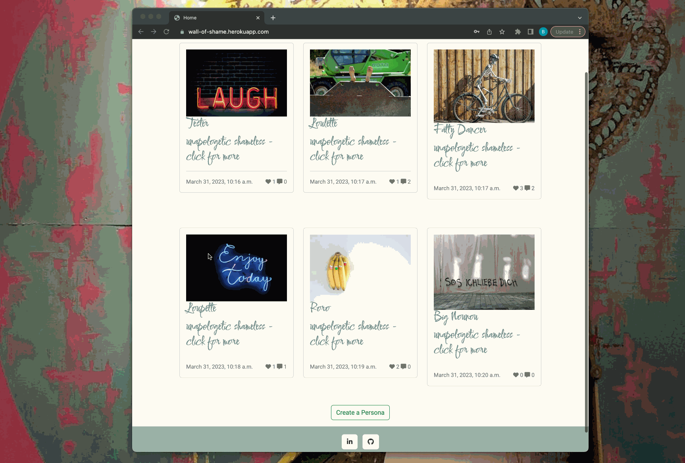

# TESTING

---

## CONTENTS

* [W3C Validator](#w3c-validator)
* [Python Linter](#python-linter)
* [Lighthouse](#lighthouse)

* [MANUAL TESTING](#manual-testing)
 
* [BUGS](#bugs)
  

---

##  W3C Validator

 There was few pages which returned errors, these errors are located within the Django Summernote library and is outwidth my control to edit therefore I have had to include this.

  

Contact page

Create a Persona page

Delete page

Index page

Sign in page

Sign out page

Persona detail page

Sign up page

Search Results page

---

#### **CSS Validation**

No errors detected.

CSS 

---

## Python Linter

No erros detected.

Contact forms.py 

Contact models.py 

Contact views.py 

Contact admin.py 

Placard views.py 

Placard models.py 

Placard forms.py 

Placard admin.py 

---

## Lighthouse

Overall the results are good. The performance criteria shows in some pages the lowest score due to the down-loaded pictures.

Contact page

Create a Persona page

Detail Persona page

Index page/ Persona list

Search Results page

Sign up page

Sign in page

Sign out page

---

## MANUAL TESTING

### Browser Compatibility

  - Testing has been carried out on the following browsers :
  - Safari on macOS Ventura (Safari  Version 13.0.1)
  - Chrome Version Version  Version 108.0.5359.124 

### Test Cases and Results

 - Chrome Developer tools and Mozilla Firefox Web Developer Tools were used throughout the development of the site to test functionality, responsive 
    behaviour, alignment correctness etc:
     - BakckBerry z30
     - BlackBerry PlayBook
     - iPhone SE
     - iPhone XR
     - iPad Air
     - Surface Duo
     - Nest Hub
     - Nest Hub Max

#### Responsive Design

 - The display of the site has been made responsive to allow it to adapt for instance the grid structure layout to a single column.

Demo

---

### Testing the user experience

1. As a site owner I want to be able to restrain the access of the contents with a required ensure the privacy sphereregistration.

| Feature       | Action        | Expected Result  | Actual Result |
| ------------- | ------------- | -------------    | ------------- |
|  Mandatory Log in  | User click on the website link  | If user not authenticated, he has to log in or register  | Works as intended |

Demo

---

7. As a site user I want to be able to create an account with a user name and password so that I can log in to access content.

| Feature       | Action        | Expected Result  | Actual Result |
| ------------- | ------------- | -------------    | ------------- |
|  Register  | Navigate to the pic pals site and click on the Sign up button located below the log in section or click of the logo WoS or Register btn in navbar. Fill in the form with the required fields for registration and click on the sign up button.  | User to create an account with the information provided in the form    | Works as expected |

Demo

---

2. As a site user, I want to be able to see the navigation bar so that I can easily navigate

| Feature       | Action        | Expected Result  | Actual Result |
| ------------- | ------------- | -------------    | ------------- |
|  Nav Bar  | Log in and scroll to the top of any page  | Nav Bar to be displayed along the top of the page or via a hamburger toggle if on a smaller screen | Works as expected |

Demo

---

3. As a site user, I want to be able to seee the footer, so that I can be redirected to social media relating to the website

| Feature       | Action        | Expected Result  | Actual Result |
| ------------- | ------------- | -------------    | ------------- |
|  Footer  | Log in and scroll to the bottom of any page  | Footer to be displayed along the bootom of the page | Works as expected |

Demo

---

8. As a site user, I want to be able to login or logout so that I can acces or quit the content of the site

| Feature       | Action        | Expected Result  | Actual Result |
| ------------- | ------------- | -------------    | ------------- |
|  Log in  | Navigate to the Wall of shame site and from the log in page enter your username and password then click on the log in button  | User to log in and be redirected to the landing page | Works as expected |

| Feature       | Action        | Expected Result  | Actual Result |
| ------------- | ------------- | -------------    | ------------- |
|  Log out  | From any page whilst logged in click on the sign out button located in the right of the nav bar, or if using a small screen device from the list from the hamburger menu toggle.  | User to log out successfully redirected to the log in page | Works as expected |

Demos

## BUGS
